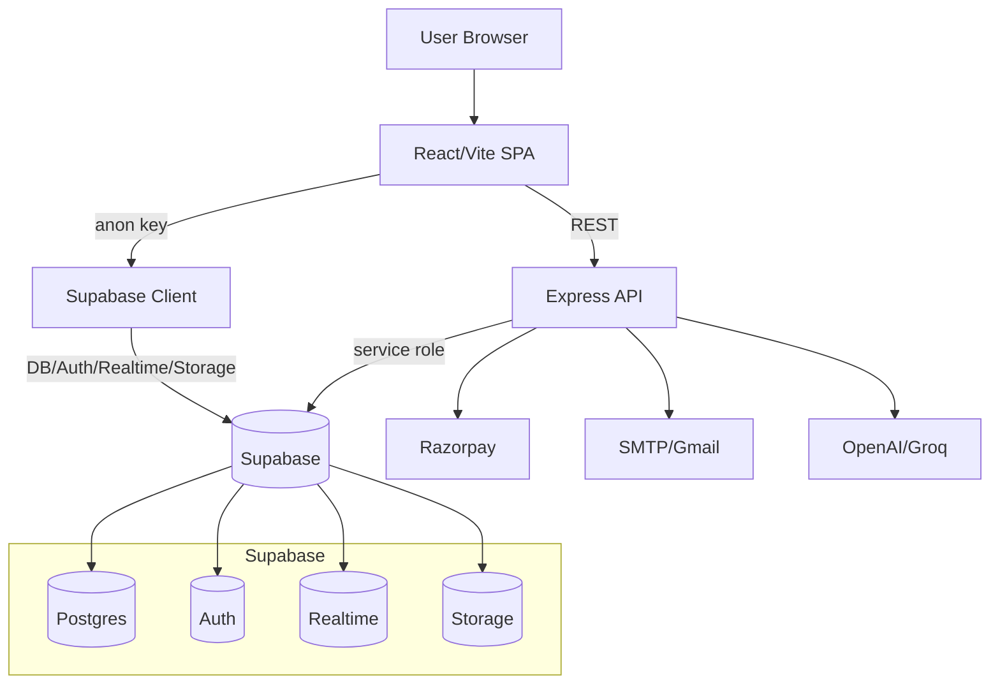
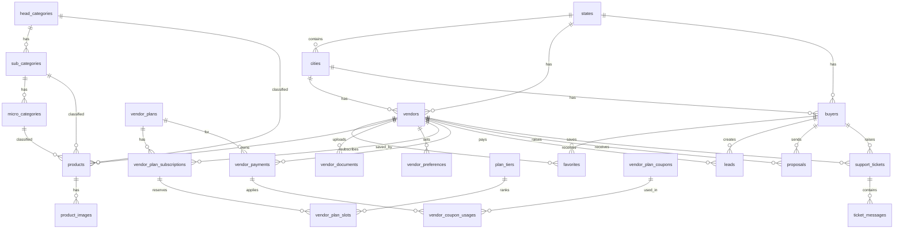
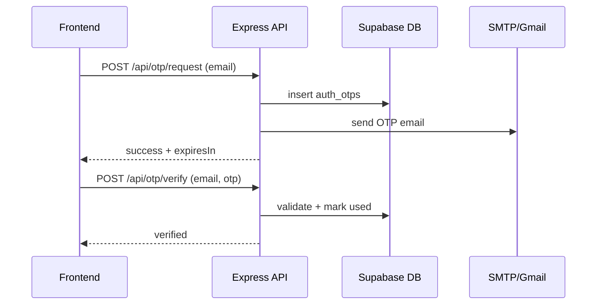
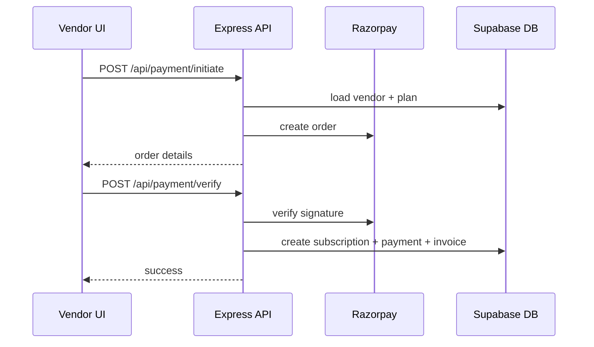
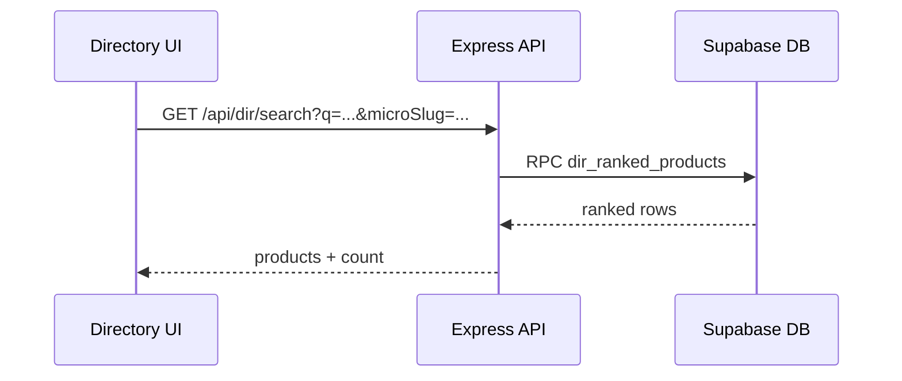

# IndianTradeMart - Frontend + Backend

B2B marketplace platform with multi-app routing (Vendor/Buyer/Admin/Directory) backed by Supabase.

## Tech Stack
- Frontend: React + Vite
- Backend: Node.js + Express
- Database/Auth/Storage: Supabase (Postgres + Auth + Realtime + Storage)
- Payments: Razorpay
- Email: SMTP/Gmail (server) + SendGrid (Supabase Edge function)
- AI: OpenAI / Groq (chatbot)

## High-Level Architecture (HLD)

## DB ER Diagram (Simplified)

## Key Sequence Flows

### 1) OTP Flow

### 2) Subscription Purchase (Razorpay)

### 3) Directory Search Ranking

## OpenAPI Spec
- File: `docs/openapi.yaml`
- Use any OpenAPI viewer (Swagger UI / Redoc) to render.

## Missing/Extra DB Objects (from code references)
Details: `docs/missing-migrations.md`

## Scripts (from package.json)
- `npm run dev` - run frontend + backend together
- `npm run dev:client` - Vite frontend only
- `npm run dev:server` - Express API only
- `npm run dev:all` - run both
- `npm run build` - generate sitemaps + build

## Netlify Deployment
- Production checklist: `docs/netlify-production.md`
- Env template for Netlify variables: `.env.netlify.example`

## Notes
- Subdomain-aware routing is supported (vendor., buyer., dir., admin.).
- Maintenance mode + public notice gates are driven by `system_config`.
- Page-level blanking uses `page_status` with realtime updates.
